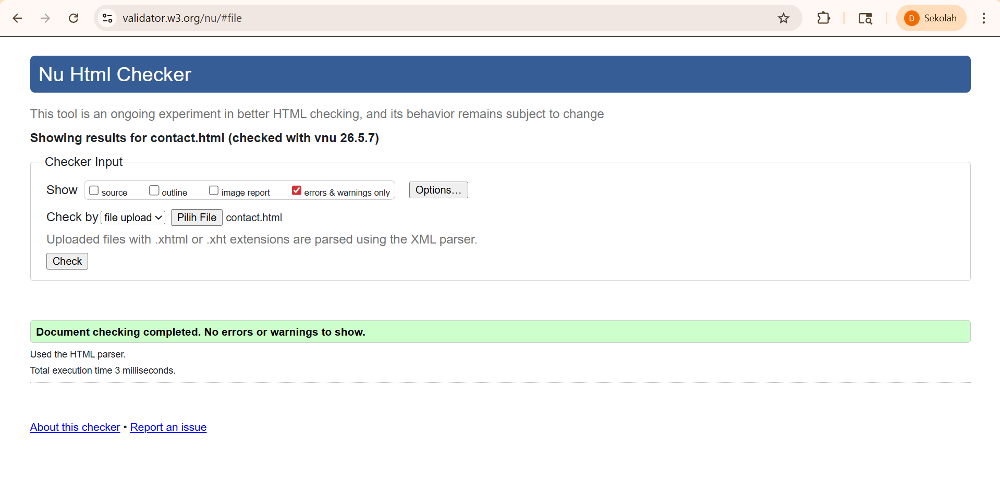
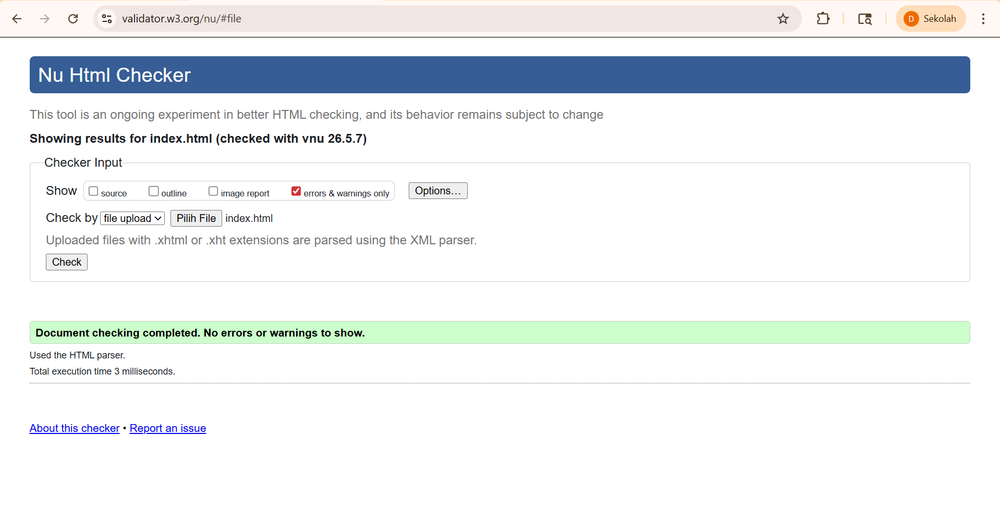
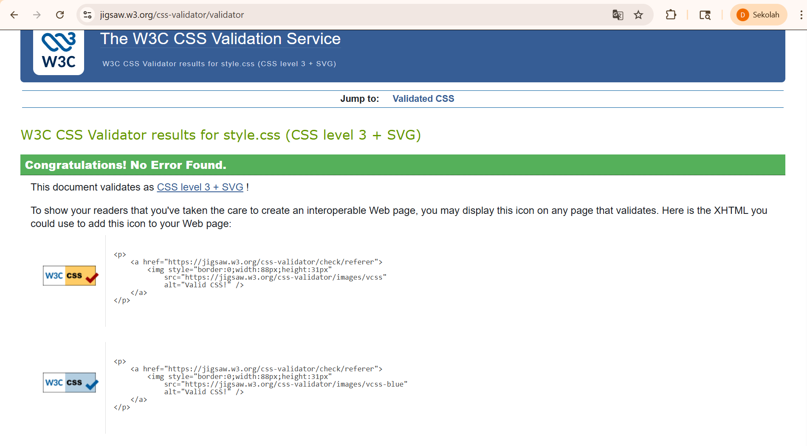
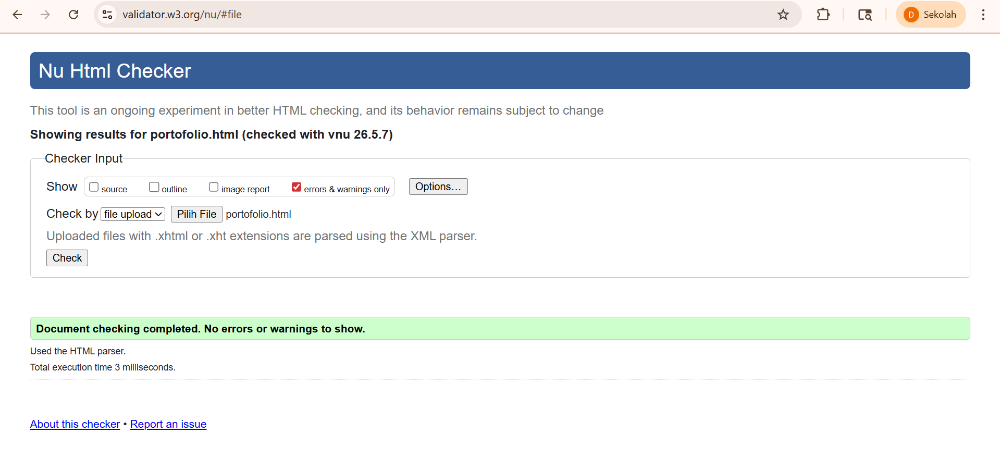
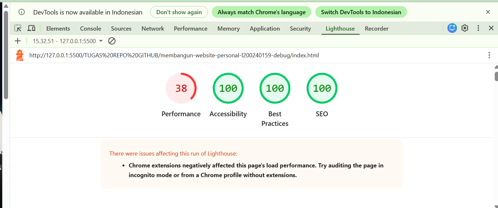
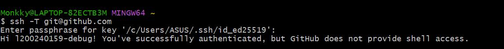

# LAPORAN PROYEK

# Deskripsi Proyek

Proyek ini bertujuan untuk membuat sebuah website sederhana sebagai bagian dari tugas mata kuliah pemrograman web. Website ini berisi informasi index yang menampilkan informasi singkat tentang pemilkik portofolio, portofolio landing page yang menampilkan identitas, pengalaman, dan proyek yang pernah dibuat, dan contact yang menampilkan sebuah informasi media agar pengunjung bisa menghubungi.

## Fitur Utama

- Halaman About / profil
- Halaman Portofolio / project
- Halaman contact
- Responsive design (mobile dan desktop)
- mode light dan dark

### Teknologi yang digunakan

- HTML
- CSS
- JavaScript
- Git & GitHub

## Struktur Folder dan File

/Tugas Repo GitHub
│
├── index.html
├── portfolio.html
├── contact.html
│── style.css
│── script.js
│
├── /images
│ └── foto1.jpg
│ └── foto2.jpg
│ └── Profill.jpg
│
├── img/
│   ├── Lighthouse.png
│   ├── Screenshot-SSH.png
│   ├── Validasi-contact-HTML.png
│   ├── validasi-CSS.png
│   ├── Validasi-Index-HTML.png
│   └── Validasi-portofolio-HTML.png
│
└── LAPORAN.md

# Link website yang sudah di-host
Berikut Link website yang sudah di-host:
https://portfolio-dzaky-orpin.vercel.app/

# Tangkapan layar hasil validasi

# Lighthouse Audit
Berikut hasil audit Lighthouse pada website:

# Tangkapan layar bukti SSH berhasil dikonfigurasi

Berikut Tangkapan layar bukti SSH berhasil dikonfigurasi:

